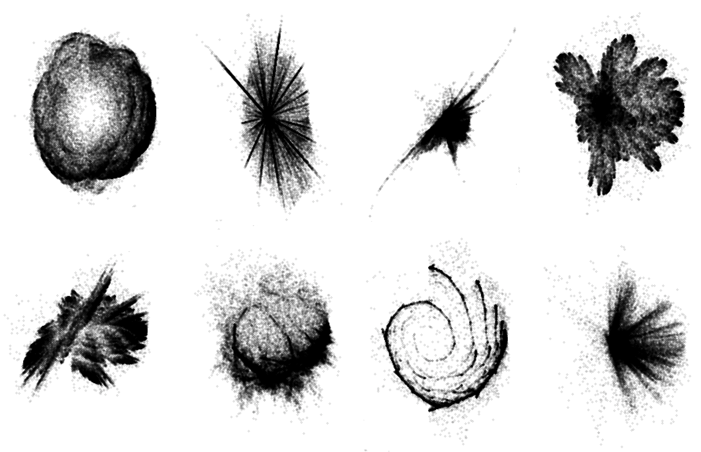
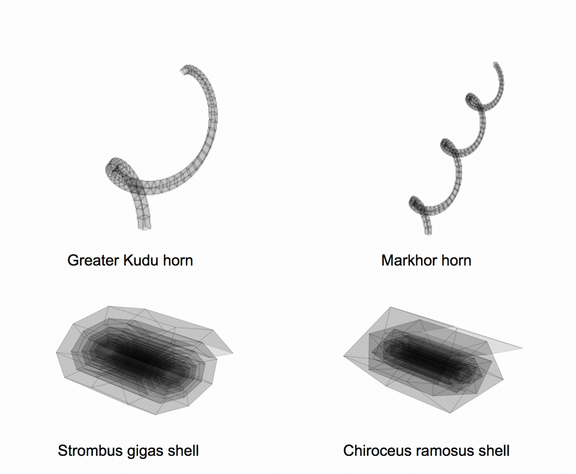

# Iterated Function Systems

## Random fractals (created using chaos games)

<a href="https://github.com/michaelsmclayton/modellingDevelopment/blob/master/mathsAndStatistics/fractals/IteratedFunctionSystems/randomChaosGames.py">randomChaosGames.py</a>

</img>
Eight example outputs from scripts, each showing different fractal shapes that can be generated using this method.

## IFS-based method for generating horns and seashells
Implementation of: 
<i>Stępień, C. (2009). An IFS-based method for modelling horns, seashells and other natural forms. Computers & Graphics, 33(4), 576-581.</i>

<a href="https://github.com/michaelsmclayton/modellingDevelopment/blob/master/mathsAndStatistics/fractals/IteratedFunctionSystems/hornsShellsAndBeaks.py">hornsShellsAndBeaks.py</a>

</img>
Example structures generated using the parameters provided by Stępień (2009).