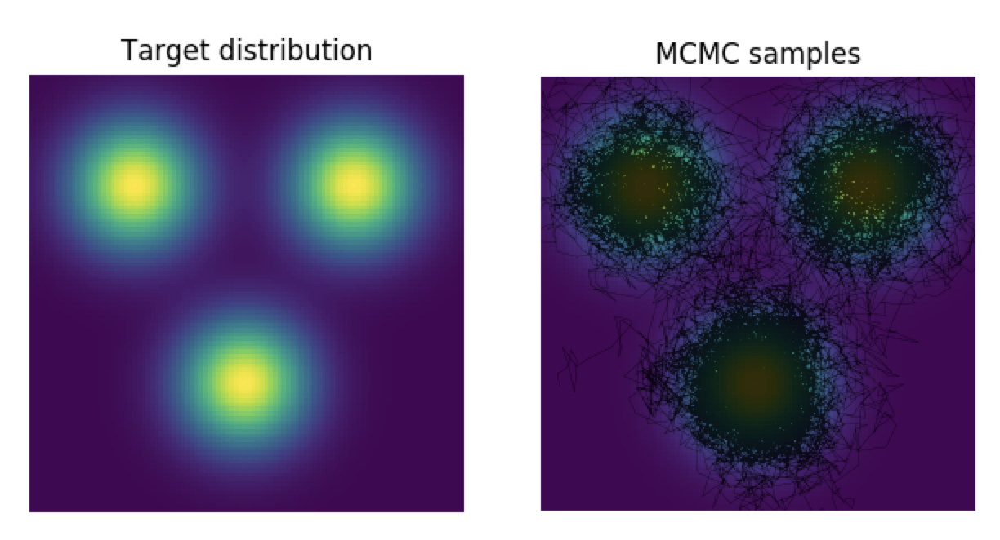

## Example of Metropolis-Hastings sampling from 2D distribution

<a href="https://github.com/michaelsmclayton/modellingDevelopment/blob/master/statistics/markovChainMonteCarlo/simpleMetropolisHastings.py">simpleMetropolisHastings.py</a> 
